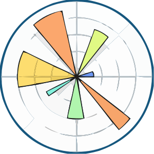

<h1 align="center">Hi 👋, I'm Gaurav Yadav</h1>
<h3 align="center">A passionate Data Scientist from India</h3>

  

  

- 🌱 I’m currently learning **Tensorflow**

- 📝 I regularly write articles about my projects on [https://medium.com/@gauravy1905](https://medium.com/@gauravy1905)

- 💬 Ask me about **Python, Data Analysis, Data Visualization, Model building, etc**

- 📫 You can reach to me **gauravy1905@gmail.com**

<h3 align="left">Connect with me:</h3>

<h2 align="left">Languages and Tools :</h2>

<h4 align="left">Programming Languages :</h4>
    

<h4 align="left">Data Analysis Tools :</h4>
  

<h4 align="left">Data Visualization :</h4>

<h4 align="left">AI/ML :</h4>
  

<h4 align="left">Web Framework :</h4>

<h4 align="left">Databases :</h4>
   

<h4 align="left">BI tools :</h4>

<h4 align="left">IDE's :</h4>

<h4 align="left">Others :</h4>

&nbsp;

